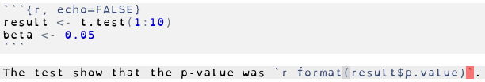

```{r setup, include=FALSE}
options(htmltools.dir.version = FALSE)
options(servr.daemon = TRUE)
```

# Collaboration Challenges

.large[
* Data in different locations
* Control changes - audit / tracking
* Mechanisms to prevent data loss
* What is the most recent version?
* Sharing work
* Manage parallel workflows
]

---

# What is Literate Programming

.large[
* A single stream of human-readable text and machine-readable code
* **Weave** the stream to get the documentation
* **Tangle** the stream to get the code
]

---

# Literate Programming Example

.large[
```{r LP_example, echo=TRUE, eval=FALSE, comment=''}
#' Mean value
#'
#' Determine mean value of a vector
#'
#' @param x numeric vector of values
#' @examples
#' myMean <- Mean(1:10)
Mean <- function(x) {
  sum(x)/length(x)
}
```
]

---
# What is Literate Stats Programming?

.large[
* It is Literate Programming applied to stat's problems
* RMarkdown is a common tool
]

---

# Literate Stat Programming Example



```{r, echo=FALSE}
result <- t.test(1:10)
```

.large[
Output:

The test show that the p-value was `r format(result$p.value)`.
]

---

# Literate Stat Programming Example

<textarea rows="20" cols="80">
`r paste(readLines('rmdExample.Rmd', n = 500), collapse='&#13;&#10;')`
</textarea>

---

# Differences between LP and LSP

.large[
* Literate Programming: 
     * code is primary
     * documentation is optional
* Literate Statistical Programming: 
    * communicating the analysis is primary
    * computer code is required, but secondary
]
---

# What are the end products

.large[
* Written report
    * Consultant Style
    * Institutional Memory Style
* Model
    * That can be put into production
    * Model is **not** decoupled from the analysis
* Do **not** save the output, save the pipeline
]

---

# Consultant Style

.large[
* Consists of the following components
    1. Introduction to the problem
    1. Planned approach
    1. Data management
    1. Descriptive statistics
    1. Inferential statistics
    1. Conclusions
* Think; journal article, report to clients
* No code in the text
]

---

# Institutional Memory Style

.large[
* Focus is on documenting a research program
* Often multi-authored
* Not a clear definition of "done"
* Many interrelated analysis
* Think; book of knowledge
]

---

# Model Workflow

.large[
* Main output is a production model
* Scripts, data and models do **not** live in different states
* Model is tied to the analysis workflow
* Improvement process is easier
]

---

# Key Issues 

.large[
1. The Fragmentation Problem
1. Non-linear Workflow
1. Rework of Analysis
1. Pipe-lining activities
1. Learning curve
]

---

# The Fragmentation Problem

.large[
* Saving all state together
* Unless they are coupled you never know the true state
]

---

# Non-linear Workflow

.large[
* Have a 'master' branch for accepted work
* Do work in branches
]

---

# Rework of Analysis

.large[
* Analysis is never done just once
* Analysis grows as understanding increases
* As data is collected/excluded, the analysis is re-run and expanded
* Code is a **live regression test**
]

---


# Pipe-lining Activities

.large[
* Pipeline what is reasonable
* Use caching mechanisms
* Premature optimization is wasteful
* Strive for **no copy-and-pasting**
* Data cleaning/validation is expensive
* Do statistics/ML in the same place you do data exploration, cleaning and tidying
]

---

# Learning curve

.large[
* Resistance to learning new tools
]
    
---

# LSP Solution

.large[
* Create Markdown documents for each analysis
* RMarkdown supports R and python
* Save the code not the output
* Version control all aspects
    * A central trunk for the main product
    * Use branching for WIP and testing
]

---

# LSP Solution

.large[
* Write report/slides as analysis is done
* Use flexible standardizations
    * Use code for standardization
    * All data **in** files
* Build an analysis pipeline
    * With changes, run the pipeline on the trunk
    * Strive for a one step process
    * Dynamically create values (no hard coding)
]

---

# Demo
